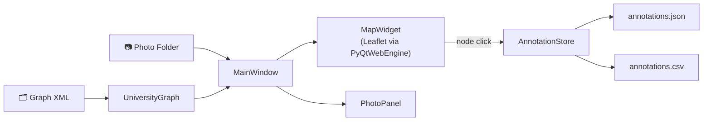

# NodeMapper


> A desktop annotation tool for linking indoor location photos to university navigation graph nodes — part of the **URWalking** research project.


***

## Motivation

Training reliable indoor navigation models requires high-quality labeled data. NodeMapper closes that gap: researchers and students load a folder of photos taken at known positions inside a university building and interactively assign each photo to its corresponding node in the floor-plan graph by clicking on a live OpenStreetMap-based map. The resulting annotations are exported as JSON or CSV and feed directly into downstream model training pipelines.

***

## Features

| Feature | Description |
|---|---|
| 🗺️ Interactive map | Leaflet + OpenStreetMap tiles with zoomable, color-coded node markers |
| 🏢 Floor-plan overlay | Georeferenced building plans rendered as image overlays |
| 🔍 Per-floor filtering | Switch between buildings, floors, and node types |
| 🕐 EXIF extraction | Automatic timestamp extraction from photo metadata |
| 🛤️ Route builder | Compose and save node sequences as JSON walking routes |
| ⌨️ Keyboard navigation | Arrow-key photo-by-photo annotation for speed |
| 💾 CSV export | One-click export of all annotations |

***

## Quickstart

### Requirements

- Python 3.12+
- [`uv`](https://github.com/astral-sh/uv) (recommended) or `pip`

### Installation

```bash
# Clone the repository
git clone <repo-url>
cd Location-Annotation-Tool

# Create virtual environment and install dependencies
uv venv
source .venv/bin/activate
uv pip install -r requirements.txt
uv pip install -e .
```

### Run

```bash
python main.py
# or without activating the venv:
uv run python main.py
```

### Update pinned dependencies

After editing direct dependencies in `pyproject.toml`:

```bash
uv pip compile pyproject.toml -o requirements.txt
```

***

## Usage

1. **Open a photo folder** — `File → Open Photo Folder` or `Ctrl+O`
2. **Select building and floor** in the top control bar
3. **Click a node** on the map to assign the current photo to that location
4. *(Optional)* **Load a floor-plan folder** to display georeferenced overlays
5. **Export annotations** as CSV via `Ctrl+S`

### Keyboard Shortcuts

| Action | Shortcut |
|--------|----------|
| Next photo | `→` / `D` |
| Previous photo | `←` / `A` |
| Clear assignment | `Del` |
| Open photo folder | `Ctrl+O` |
| Export CSV | `Ctrl+S` / `Ctrl+E` |

### Route Builder

Enable **Route Mode** to record ordered node sequences (e.g. a walking path through a corridor). Routes are saved as JSON and can be reloaded in later sessions.

***

## Architecture



***

## Project Structure

```
Location-Annotation-Tool/
├── main.py                     # Entry point
├── pyproject.toml              # Project metadata and dependencies
├── requirements.txt            # Pinned dependency lockfile
├── .python-version             # Python 3.12
├── images/                     # Screenshots and documentation assets
│
└── src/
    ├── annotator/              # GUI application package
    │   ├── app.py              # Application entry point and dark theme setup
    │   ├── constants.py        # Node type color palette and filter constants
    │   ├── store.py            # AnnotationStore — JSON/CSV persistence
    │   ├── resources/
    │   │   ├── __init__.py     # load_map_html() — injects runtime constants
    │   │   └── map.html        # Leaflet HTML/JS map template
    │   ├── utils/
    │   │   └── exif.py         # EXIF timestamp extraction
    │   ├── widgets/
    │   │   ├── map_widget.py   # MapBridge (JS ↔ Python) and MapWidget
    │   │   └── photo_panel.py  # Photo preview panel with metadata display
    │   └── windows/
    │       └── main_window.py  # MainWindow — UI layout and event handling
    │
    ├── graph/                  # Navigation graph data model
    │   └── university_graph.py # UniversityGraph — XML parser, node/edge DataFrames
    │
    └── viz/                    # Visualization utilities (Jupyter-compatible)
        └── urwalking_viz.py    # BuildingGraph, UniversityMap — Plotly, Folium, pydeck
```

***

## Dependencies

| Package | Purpose |
|---------|---------|
| PyQt5 + PyQtWebEngine | Desktop GUI and embedded Leaflet map |
| pandas | Node and edge DataFrames |
| Pillow | EXIF extraction and image loading |
| networkx | Graph data structure and shortest-path queries |
| matplotlib | Basic floor-plan plots |
| folium | Interactive OSM maps (analysis) |
| plotly | 2D/3D visualizations (analysis) |
| pydeck | 3D maps over OSM (analysis) |

***

## Citation

If you use NodeMapper in your research, please cite:

```bibtex
@software{nodemapper2025,
  title   = {NodeMapper: Indoor Location Annotation Tool},
  author  = {},
  year    = {2025},
  url     = {},
  note    = {Part of the URWalking project}
}
```

***

## License

MIT — see [LICENSE](LICENSE) for details.
